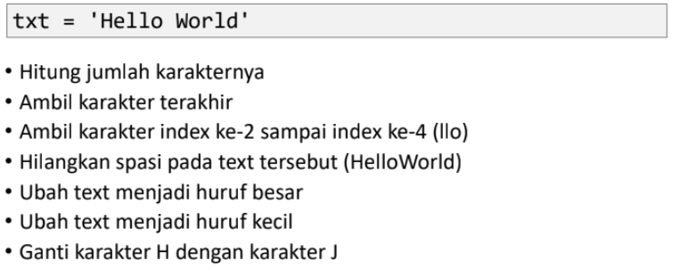
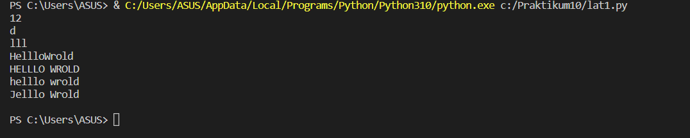
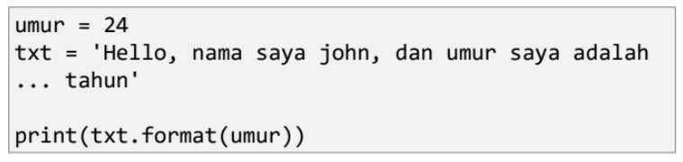
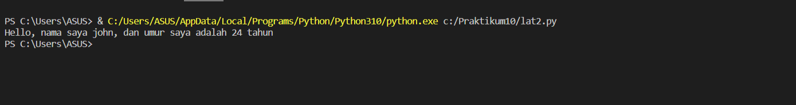

## Praktikum 10 

Nama: Alifia Ananda Putri

Nim: 312210168

Kelas: TI.22.A2

Mapel: B. Pemrograman

## Python String

1. String adalah jenis yang paling populer di Python.
2. Untuk membuatnya hanya dengan melampirkan karakter dalam tanda kutip.
3. Python memperlakukan tanda kutip tunggal (' ') sama dengan tanda kutip ganda (" ").
4. Membuat string semudah memberi nilai pada sebuah variabel.

## Latihan 1

## Penjelasan Latihan 1

1. Untuk menghitung jumlah karakter, gunakan fungsi len().

# Menghitung jumlah karakternya
print(len(txt))

2. Cara mengambil satu karakter pada string yaitu dengan menggunakan kurung siku [ ] dan deklarasi nomor di dalam kurung siku dengan urutan ARRAY dan menggunakan titik dua lalu masukan nomor ARRAY selanjutnya. Untuk mengambil karakter terakhir, gunakan index [-1]. Sedangkan untuk mengambil karakter index ke-2 sampai ke-4, gunakan index [2:5].

# Mengambil karakter terakhir
print(txt[-1])
# Mengambil karakter index ke-2 sampai index ke-4 (llo)
print(txt[2:5])

3. Jika ingin menghilangkan spasi pada string, gunakan method replace(). Method replace() mengganti semua kemunculan string lama dengan yang baru atau paling banyak kemunculan.

4. Di dalam method replace, kita dapat menggunakan 2 cara, yang pertama bisa menggunakan (txt.replace(" ", "")) dan kedua dengan cara (txt.replace(txt[5], "")).

# Menghilangkan spasi pada text tersebut (HelloWorld)
print(txt.replace(" ", ""))

5. Untuk mengubah huruf menjadi besar, gunakan method upper(). Sedangkan jika ingin mengubah huruf menjadi kecil, gunakan method lower().

# Mengubah text menjadi huruf besar
print(txt.upper())
# Mengubah text menjadi huruf kecil
print(txt.lower())

6. Untuk mengganti karakter 'H' dengan karakter 'J', gunakan method replace().

# Mengganti karakter H dengan karakter J
print(txt.replace("H", "J"))
print()

## Output Latihan 1

## Latihan 2

## Penjelasan latihan 2

  umur = 24
  txt = "\nHello, nama saya john, dan umur saya adalah {0} tahun\n"

  print(txt.format(umur))

## Output latihan 2

Terimakasih

